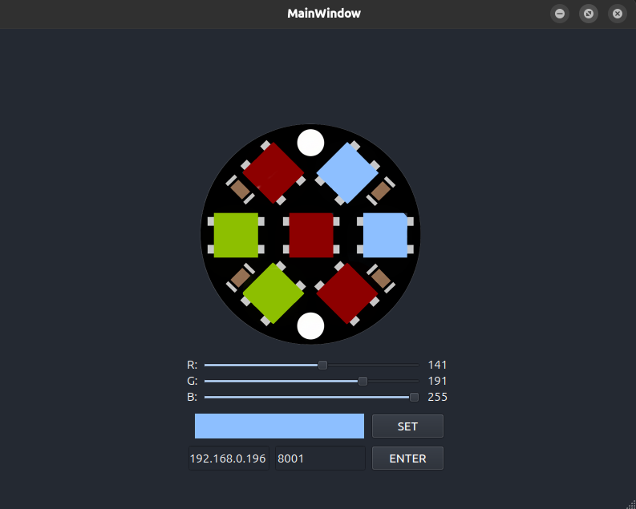
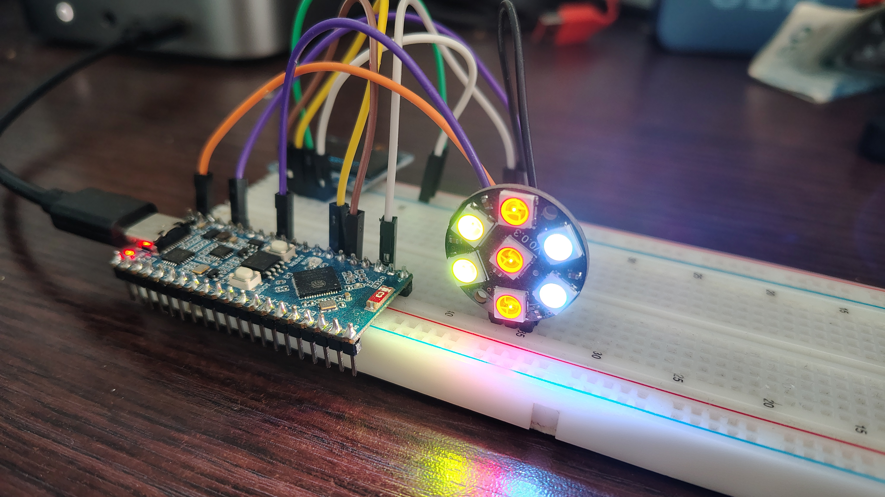

### Usage
1. Enter the **IPv4 address** and **host**.
2. **Single-click** the left mouse button on a LED to select it for modification.
3. Choose a color using **RGB components**.
4. Click **SET** to transmit the changes.

### UI

### Result

